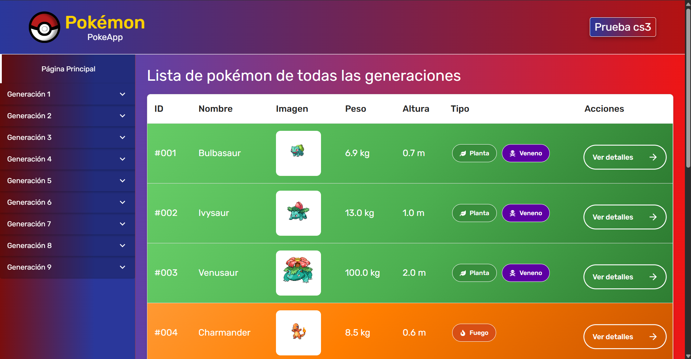

<p align="center">
  
</p>

<h1 align="center">Pokémon App</h1>
<p align="center">Una aplicación web para explorar Pokémon usando la PokéAPI, construida con React, Vite, Zustand, y más.</p>

---

## 🚀 Demo en producción

👉 [Ver la aplicación en GitHub Pages](https://jesusdavid31.github.io/PokeApp/)

---

## 🧩 Tecnologías utilizadas

- ⚛️ [React](https://reactjs.org/)
- ⚡ [Vite](https://vitejs.dev/)
- 🛠️ [TypeScript](https://www.typescriptlang.org/)
- 🐱 [Zustand](https://zustand-demo.pmnd.rs/)
- 🌐 [PokéAPI](https://pokeapi.co/)
- 📦 [pnpm](https://pnpm.io/)
- 💡 [Jest](https://jestjs.io/) (Para pruebas)
- 🖼️ [react-lazy-load-image-component](https://www.npmjs.com/package/react-lazy-load-image-component) (Lazy Loading para las imágenes)
- ✨ [Framer Motion](https://www.framer.com/motion/) (Animaciones y transiciones suaves en las tabla)
- 📱 **Responsive** → diseño adaptado para desktop y móvil.

---

## 🛠️ Instalación y ejecución local

Asegúrate de tener instalado [pnpm](https://pnpm.io/):

```bash
npm install -g pnpm
```

Luego clona el repositorio y ejecuta:

```bash
pnpm install
pnpm dev
```

La aplicación estará disponible en: [http://localhost:5173](http://localhost:5173)

---

## 🖼️ Preview

  

---

## 📦 Scripts disponibles

```bash
pnpm dev         # Ejecuta el servidor de desarrollo
pnpm build       # Compila el proyecto para producción (TypeScript + Vite)
pnpm preview     # Sirve la app ya compilada
pnpm lint        # Ejecuta el linter
pnpm gh-deploy   # Compila y publica en GitHub Pages
pnpm test        # Ejecuta las pruebas con Jest
```

---

## 🌍 Despliegue en GitHub Pages

Este proyecto está configurado para desplegarse en la rama `gh-pages`.  
Para hacerlo, simplemente ejecuta:

```bash
pnpm gh-deploy
```

> Se utiliza `HashRouter` para garantizar la compatibilidad con GitHub Pages y evitar errores 404 en rutas dinámicas.

---

## 📁 Estructura del proyecto (simplificada)

```
src/
├── assets/              # Imágenes y recursos estáticos
├── components/          # Componentes reutilizables
│   ├── AnimatedButton
│   ├── DynamicTable
│   ├── Header
│   ├── Loadable
│   ├── Sidebar
│   └── SkeletonTable
├── hooks/               # Hooks personalizados
│   └── usePokemonGenerations.ts
├── interfaces/          # Interfaces de tipos
│   ├── pokemon-colors.interface.ts
│   └── pokemon.interface.ts
├── layouts/             # Layouts de rutas
│   └── blank/           # Layout vacío
│       └── BlankLayout.tsx
├── pages/               # Páginas principales (Home, Detalle, etc.)
│   ├── PokemonDetailsPage
│   ├── PokemonGenerationsPage
│   └── PokemonListPage
├── routes/              # Definición de rutas
│   └── Router.tsx
├── store/               # Estado global con Zustand
│   ├── listPokemon.store.ts
│   ├── pagination.store.ts
│   └── pokemonGenerations.store.ts
├── utils/               # Utilidades generales
│   └── formatTypes.tsx
├── App.tsx              # Componente principal
├── App.css              # Estilos generales
└── main.tsx             # Punto de entrada principal
```

---

## 📜 Rutas de la aplicación

Este proyecto usa las siguientes rutas:

- `/`: Página principal que lista los Pokémon de todas las generaciones.
- `/:generation`: Muestra los Pokémon de una generación específica.
- `/pokemon/:name`: Muestra los detalles de un Pokémon específico.

---

## 📄 Licencia

Este proyecto está licenciado bajo la licencia MIT.

> ⚠️ Este repositorio es de solo lectura. No se aceptan contribuciones externas ni pull requests.
